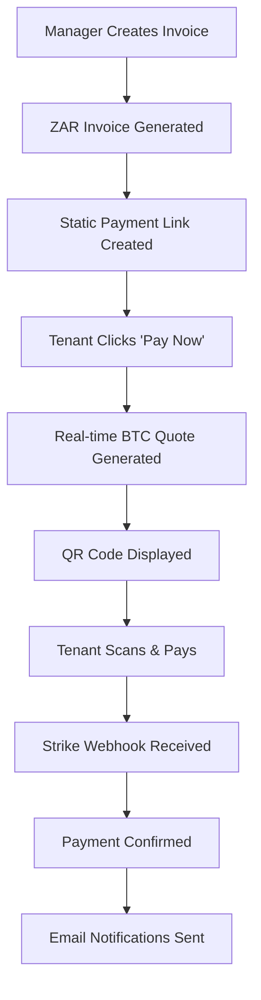

# 🔥 Bitcoin Lightning Payment System

Complete ZAR-to-BTC rent payment system using Strike API integration.

## ⚡ Features

- **Real-time ZAR-to-BTC conversion** using Strike API
- **Lightning Network payments** with 15-minute quote expiration
- **Professional PDF invoices** with Bitcoin payment links
- **Mobile-responsive payment interface** with QR codes
- **Automated payment confirmation** via webhooks
- **Demo mode** for testing without API credentials
- **Admin notifications** and comprehensive audit trail

## 🚀 Quick Start

### 1. Demo Mode (No API Required)

The system works immediately in demo mode:

1. Navigate to any lease → **Financials** → **Current Invoice**
2. Click **"Pay with Bitcoin"** button
3. See the complete payment flow with simulated data
4. Payment success is simulated after 30 seconds

### 2. Production Setup

For real Bitcoin payments, configure Strike API:

```bash
# Copy environment template
cp backend/env_template_bitcoin.txt backend/.env

# Add your Strike API credentials
STRIKE_API_KEY=your-actual-api-key
STRIKE_WEBHOOK_SECRET=your-webhook-secret
```

## 📋 API Endpoints

### Payment Management
```
POST /api/payments/create-invoice/      # Create ZAR invoice
POST /api/payments/generate-quote/      # Get real-time BTC quote  
GET  /api/payments/status/{invoice_id}/ # Check payment status
POST /api/payments/webhook/strike/      # Strike webhook handler
GET  /api/payments/exchange-rate/       # Current ZAR-BTC rate
```

### Frontend Routes
```
/pay/{tenant_id}/invoice/{invoice_id}/  # Payment page with QR codes
```

## 🎯 Payment Flow



## 💾 Database Models

- **StripeInvoice** - Rent invoices in ZAR with Strike integration
- **LightningQuote** - Real-time BTC conversion quotes (15-min expiry)
- **PaymentTransaction** - Completed payment records for accounting
- **WebhookEvent** - Audit trail for all Strike webhook events

## 🎨 User Interface

### Payment Page Features
- **Gradient glassmorphism design** with dark theme
- **Real-time countdown timer** for quote expiration
- **QR code generation** using `qrcode.react`
- **Copy-to-clipboard** functionality for Lightning invoices
- **Payment status polling** every 5 seconds
- **Success page** with receipt printing

### PDF Integration
- **"Pay with Bitcoin" buttons** in lease invoice interface
- **Clickable Bitcoin payment links** in PDF invoices
- **Professional invoice generation** with Lightning bolt icons
- **Orange Bitcoin branding** throughout the interface

## 🔧 Technical Implementation

### Backend (Django)
- **Strike API service** with comprehensive error handling
- **Webhook signature verification** for security
- **Django signals** for post-payment processing
- **JWT authentication** for admin endpoints
- **Public tenant access** to payment pages

### Frontend (Next.js)
- **TypeScript interfaces** for type safety
- **React hooks** for state management
- **Responsive design** with Tailwind CSS
- **Real-time updates** via polling and state management
- **Error boundaries** and retry mechanisms

## 📧 Notifications

### Automatic Emails
- **Payment confirmation** to tenants
- **Admin notifications** for received payments
- **HTML templates** with professional branding
- **Plain text fallbacks** for compatibility

### Integration Points
- **Finance system integration** for accounting
- **Lease management** connection for rent tracking
- **Admin panel** for payment monitoring

## 🛡️ Security Features

- **Webhook signature verification** using HMAC
- **Rate limiting** and error handling
- **Input validation** and sanitization
- **Secure token management** for API calls
- **Audit trails** for all payment events

## 📱 Mobile Support

- **Responsive design** works on all devices
- **Touch-friendly** QR code scanning
- **Mobile wallet integration** via Lightning URLs
- **Optimized performance** for mobile networks

## 🔍 Testing

Run the comprehensive test suite:

```bash
# Backend tests
cd backend
python manage.py test payments

# Frontend demo
npm run dev
# Navigate to lease → Current Invoice → Pay with Bitcoin
```

## 📈 Admin Features

### Django Admin Panel
- **Strike invoice management** with payment status
- **Lightning quote tracking** with expiration times
- **Payment transaction history** with BTC amounts
- **Webhook event logs** for debugging
- **Tenant payment listings** and search

### Reporting
- **Payment analytics** and success rates
- **Exchange rate tracking** over time
- **Failed payment analysis** and retry logic
- **Revenue reporting** in both ZAR and BTC

## 🌍 Production Deployment

### Environment Variables
```bash
STRIKE_API_KEY=your-production-key
STRIKE_WEBHOOK_SECRET=your-webhook-secret
PAYMENT_BASE_URL=https://yourdomain.com/pay
PAYMENT_NOTIFICATION_EMAILS=admin@yourdomain.com
```

### Webhook Configuration
Set up Strike webhook endpoint:
```
https://yourdomain.com/api/payments/webhook/strike/
```

Required events:
- `invoice.created`
- `invoice.updated`
- `invoice.paid`
- `invoice.canceled`

## 🎯 Key Benefits

✅ **Instant ZAR-to-BTC conversion** at payment time
✅ **No exchange rate risk** for property managers  
✅ **Global Bitcoin payments** from anywhere
✅ **Lightning fast settlements** (seconds, not days)
✅ **Low transaction fees** compared to traditional banking
✅ **Complete audit trail** and accounting integration
✅ **Professional user experience** matching traditional payments
✅ **Demo mode** for risk-free testing and training

## 📞 Support

- **Demo Mode**: Works immediately without configuration
- **Production Setup**: Requires Strike API account
- **Integration Support**: Complete API documentation provided
- **Testing**: Comprehensive test suite included

---

**Ready to accept Bitcoin rent payments!** 🏠⚡💰 